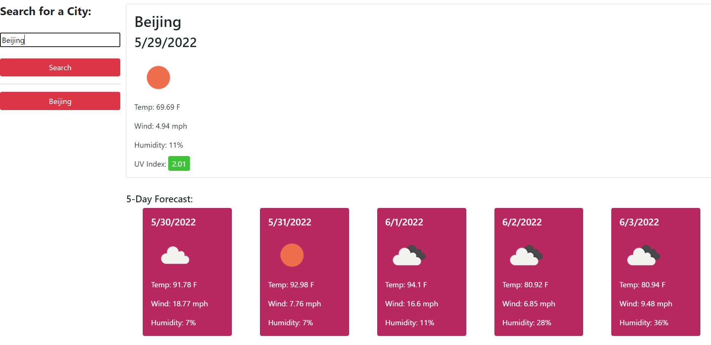
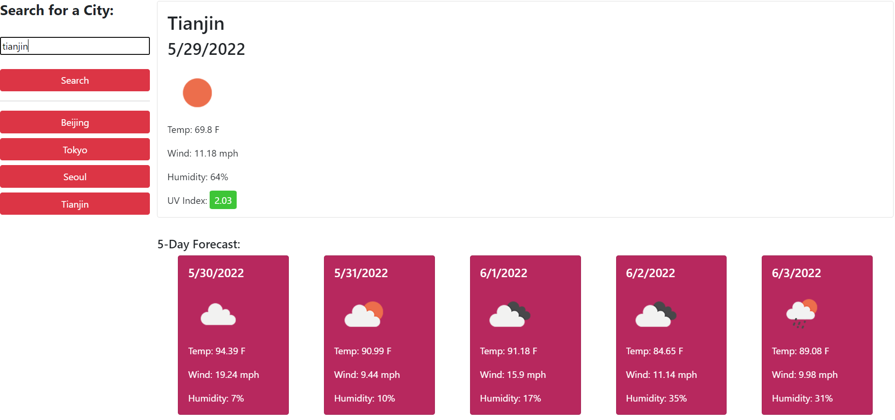

# Weather Forecast Generator Using API 

## Description 
Planning a trip and want to look up the weather to plan ahead? Or just want to see the forecast in general? Using this browser application, you can view the current forecast and a five day forecast for hundreds of thousands of cities across the world. The forecasts provided include the temperature, wind speeds, humidity, and the UV index for the current time. Your searches are saved: if you would like to view the forecast for a city you've previously searched, simply click its respective button on the left side of the page, and all the details will once again display. 

This app draws its weather data from OpenWeather's server-side weather APIs, which are updated continuously throughout the day, so the forecast you see at one moment may not necessarily be the same if you were to look up the location later. A request is sent to the server that, if conditions are met, will return a JSON file containing all the relevant data, which can be viewed in the browser console if a user wishes. Only certain pieces of information are used for the purposes of this app: the ones stated above, as well as the daily forecast information that gives details on future days. 

### Technologies
- HTML
- CSS
- Javascript
- OpenWeather APIs (Geocoding and One Call)
- Moment.js 

### Page Image

### Final Github Link
[Link to the final page through Github](https://reversedentistry.github.io/Weather-Reports/)

### Author
**Sheryl Hu**
- Email: sherylhu@proton.me

### License
Copyright (c) 2022 Sheryl Hu.
This project is MIT licensed.